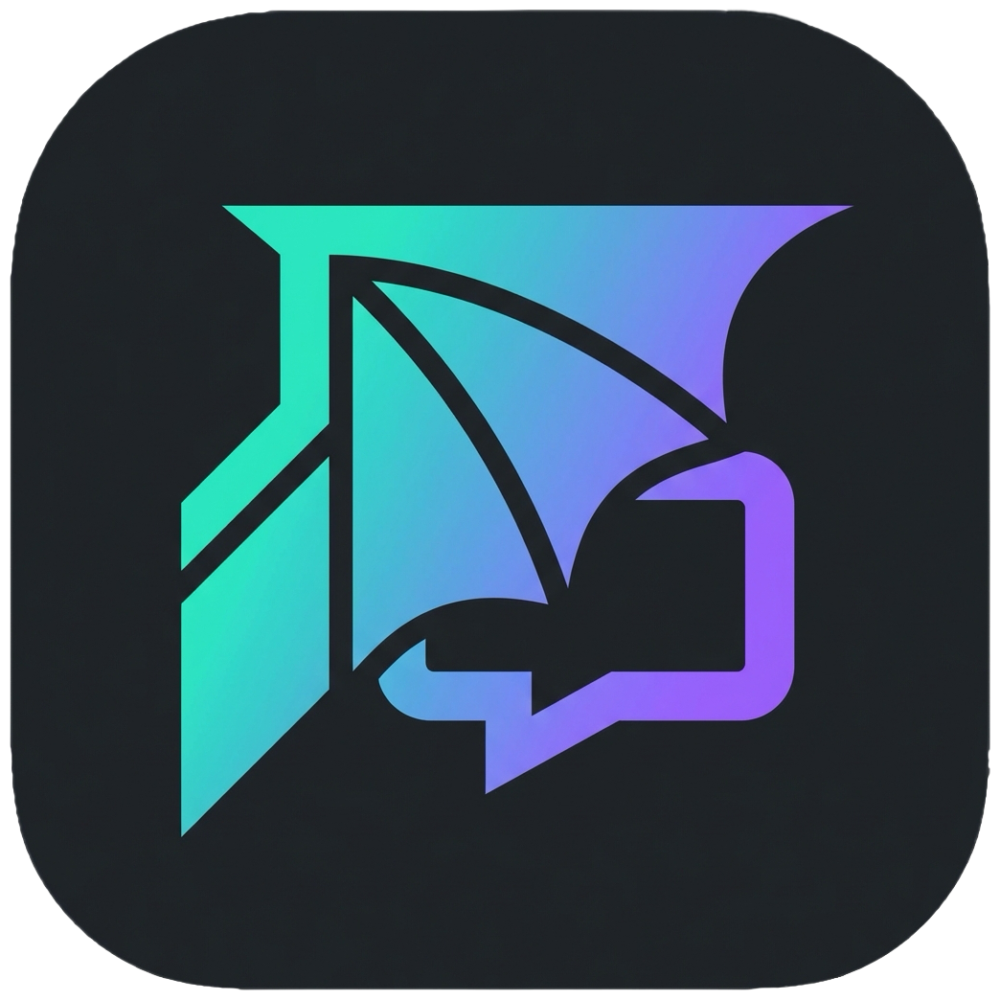
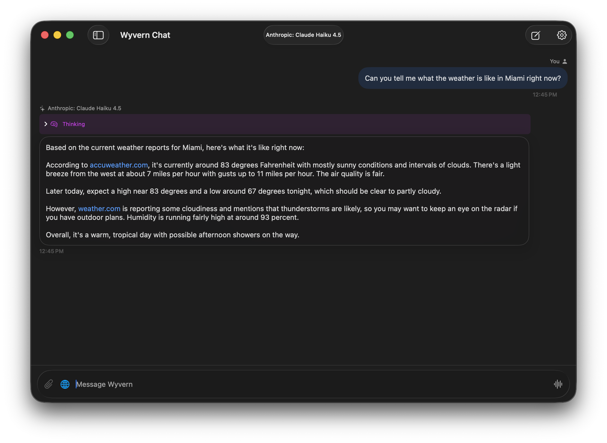
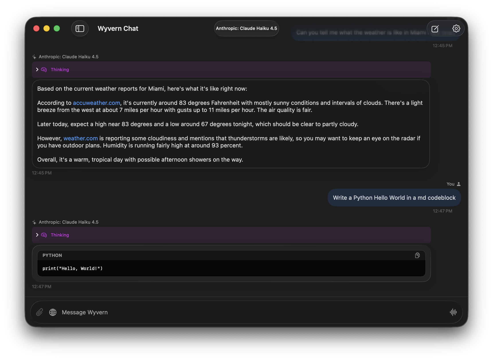
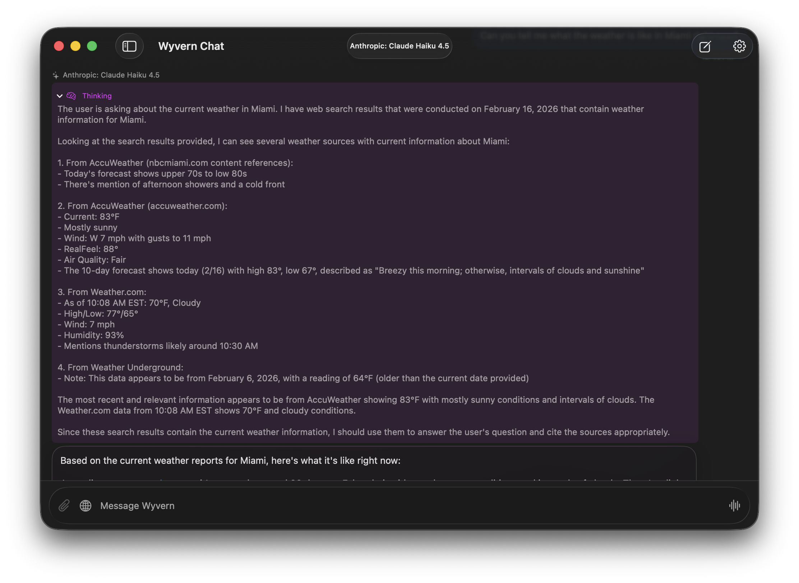
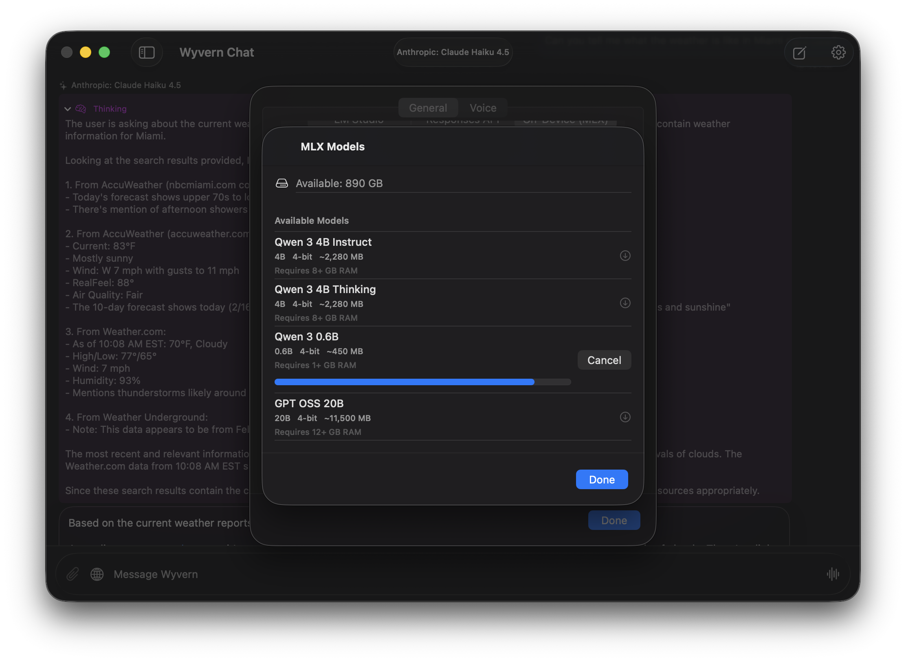
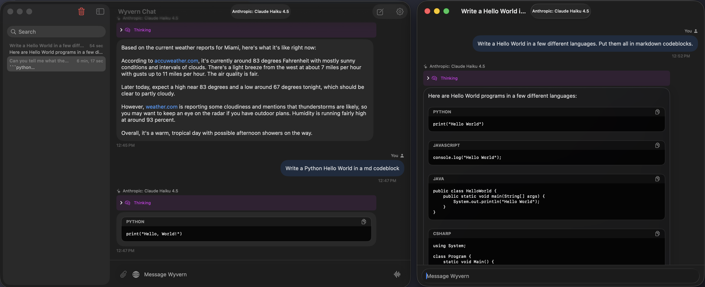

<p align="center">
  
</p>

<h1 align="center">Wyvern Chat</h1>

<p align="center">
  <strong>A native, privacy-first chat client for macOS, iOS, and iPadOS.</strong><br/>
  One beautiful interface. Multiple LLM providers. Zero compromises.
</p>

<p align="center">
  
  
  
</p>

<br/>

<!-- SCREENSHOT: Main chat window (macOS), ideally showing a streaming response with markdown.
     Recommended size: ~1200px wide, retina. -->
<p align="center">
  
</p>

<br/>

---

## Why Wyvern

Wyvern Chat is built entirely in **SwiftUI** with no external UI dependencies — just Apple frameworks the way they were meant to be used. It connects to local and cloud LLM providers through a single, unified interface that feels right at home on every Apple device.

- **Run models on your own hardware** with LM Studio or Apple Silicon MLX inference
- **Connect to cloud providers** like OpenAI and OpenRouter when you need frontier models
- **Keep your data private** — local-first by design, cloud access fully optional

<br/>

## Features

### Multi-Provider Architecture

Seamlessly switch between providers without leaving the conversation.

| Provider | Type | Highlights |
|:---------|:-----|:-----------|
| **LM Studio** | Local server | Direct HTTP API, MCP plugins, custom context length |
| **OpenAI / OpenRouter** | Cloud API | Reasoning effort control, web search, extended context |
| **MLX** | On-device | Apple Silicon native inference, HuggingFace model downloads |

<br/>

### Streaming & Markdown

Responses stream in real time at a buttery 60 fps with full Markdown rendering — code blocks with syntax highlighting, tables, headers, and inline formatting.

<!-- SCREENSHOT: A message with rich markdown — code block, table, or bullet list.
     Recommended size: ~800px wide. -->
<p align="center">
  
</p>

<br/>

### Advanced Reasoning

Watch the model think. Wyvern auto-detects reasoning formats (OpenAI Harmony, `<think>` tags) and renders them in collapsible sections that stay open while streaming and collapse once complete — no layout jumps.

<!-- SCREENSHOT: A response showing an expanded reasoning/thinking section.
     Recommended size: ~800px wide. -->
<p align="center">
  
</p>

<br/>

### Web Search

Ground responses with real-time web data. Toggle search on any OpenRouter model and get cited, up-to-date answers.

<br/>

### Voice In, Voice Out

Speak your prompts with native speech recognition and hear responses read back with your choice of system TTS, OpenAI voices, or ElevenLabs.

<br/>

### Model Context Protocol (MCP)

Connect external tools to your conversations on macOS. Wyvern supports both stdio and HTTP MCP servers with automatic tool discovery and execution.

<br/>

### On-Device Inference with MLX

Run curated models directly on Apple Silicon — Qwen, Mistral, Gemma, GPT-OSS, and more — with HuggingFace downloads, progress tracking, and GPU memory management. No server required.

<!-- SCREENSHOT: MLX model management view showing downloaded models or a download in progress.
     Recommended size: ~800px wide. -->
<p align="center">
  
</p>

<br/>

### Multimodal Input

Attach images and documents directly in the composer. Supported formats include JPEG, PNG, GIF, WebP, HEIC, SVG, PDF, and common text/code files.

<br/>

### Multi-Window & Stage Manager

Open conversations in their own windows on macOS and iPadOS. Full Stage Manager support with deep linking via the `wyvern://` URL scheme.

<!-- SCREENSHOT: Multiple windows open on macOS or iPadOS Stage Manager.
     Recommended size: ~900px wide. -->
<p align="center">
  
</p>

<br/>

### Liquid Glass Design

Native iOS 26 / macOS Tahoe glass morphism on every surface — message bubbles, toolbars, sidebars — using Apple's `.glassEffect()` API for a cohesive, distinctly Apple feel.

<br/>

---

## Getting Started

### Prerequisites

- **macOS 26.0 Tahoe** or later / **iOS 26.0** or later
- **Xcode 26+** (to build from source)
- At least one LLM provider:
  - [LM Studio](https://lmstudio.ai/) for local server inference
  - An [OpenAI](https://platform.openai.com/) or [OpenRouter](https://openrouter.ai/) API key for cloud models
  - An Apple Silicon device for on-device MLX inference

### Clone & Build

```bash
git clone https://github.com/warshanks/wyvern-chat.git
cd wyvern-chat
```

Open `WyvernChat/WyvernChat.xcodeproj` in Xcode, select your target device, and press <kbd>Cmd</kbd> + <kbd>R</kbd>.

### Configuration

**LM Studio** — Start the LM Studio local server on port `1234` (the default). Wyvern connects automatically.

**Cloud Providers** — Add your API key in **Settings** and optionally configure a custom base URL.
<br/>

---

## Architecture

```
WyvernChat/
├── Services/            # LLM provider implementations & protocols
│   ├── LLMService       # Provider protocol
│   ├── LMStudioService  # Local server
│   ├── OpenAIResponses…  # Cloud API (OpenAI / OpenRouter)
│   ├── MCPService        # Model Context Protocol (macOS)
│   └── TTSService        # Text-to-speech (system / OpenAI / ElevenLabs)
├── ViewModels/          # MVVM state management
│   ├── ChatViewModel     # Streaming, messages, conversation state
│   └── SettingsViewModel # Per-provider settings & persistence
├── Views/               # SwiftUI view hierarchy
│   ├── ContentView       # Navigation split (sidebar + chat)
│   ├── ChatView          # Message list & composer
│   ├── SettingsView      # Tabbed settings
│   └── Components/       # MessageBubble, Markdown, CodeBlock, …
├── Models/              # Data types & API models
├── Design/              # Theme system & Liquid Glass
└── MLXService           # On-device Apple Silicon inference
```

**Key design decisions:**
- **MVVM + Swift Actors** — thread-safe async operations across all providers
- **Protocol-oriented providers** — identical UX regardless of backend
- **VStack over LazyVStack** — prevents scroll drift during rapid streaming
- **Zero external UI dependencies** — pure SwiftUI + Apple frameworks

<br/>

---

## License

This project is proprietary software. All rights reserved. See the [LICENSE](LICENSE) file for details.

<br/>

