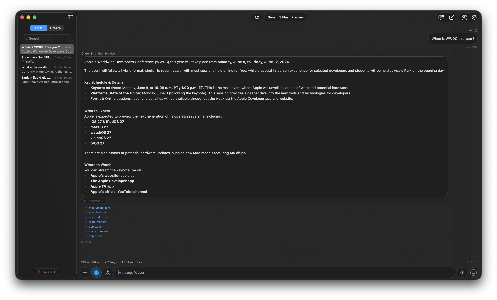
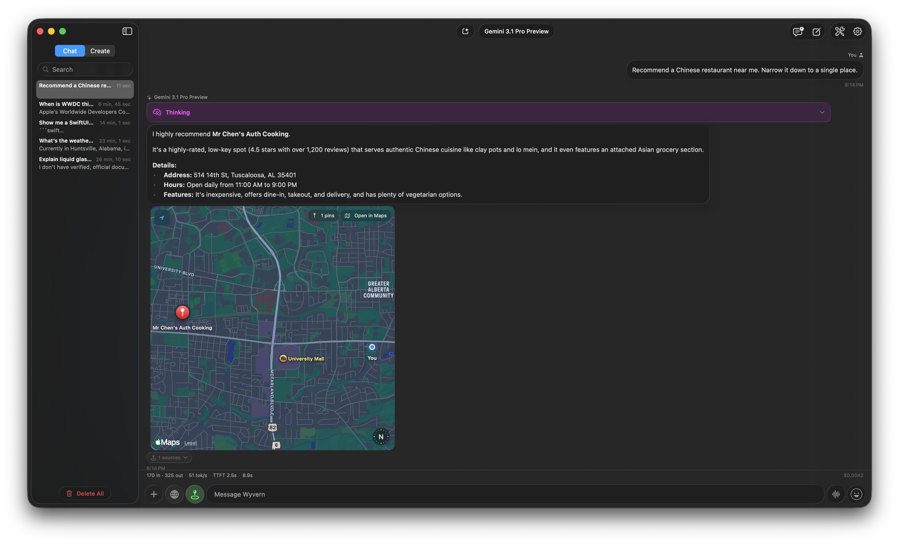
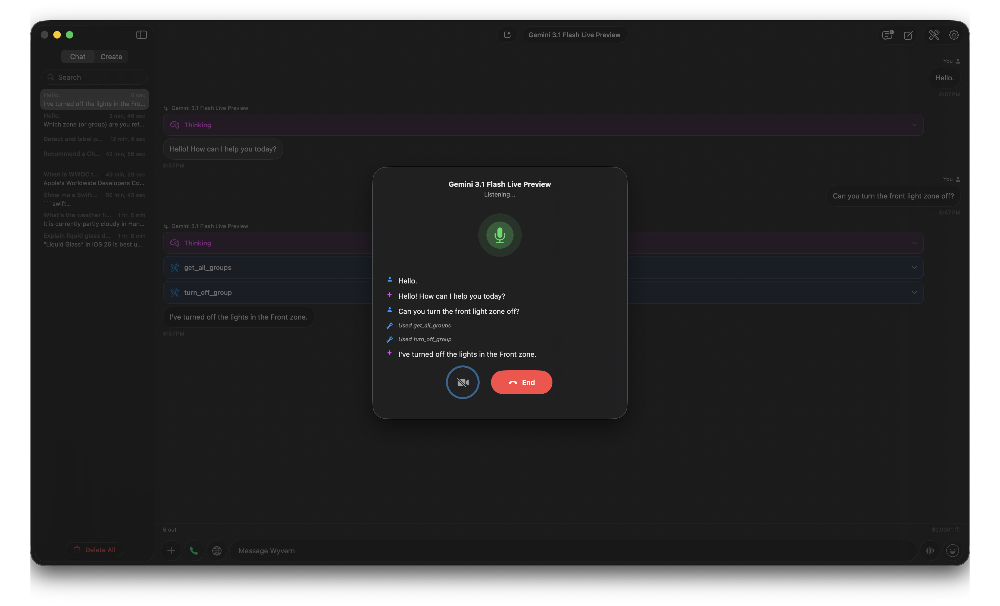
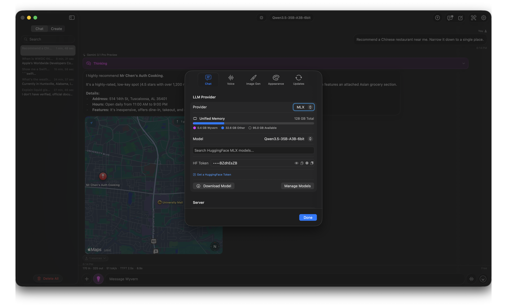

  

<h1 align="center">Wyvern Chat</h1>

  <strong>A native, privacy-first chat client for macOS, iOS, and iPadOS.</strong> 
  One beautiful interface. Nine LLM backends. Zero compromises. 
  Text, image, video, and music generation and analysis. 

  
  
  
  
  

 

<!-- SCREENSHOT: Main chat window (macOS), ideally showing a streaming response with markdown.
     Recommended size: ~1200px wide, retina. -->

  

 

  <a href="#why-wyvern">Why Wyvern</a> ·
  <a href="#providers">Providers</a> ·
  <a href="#features">Features</a> ·
  <a href="#getting-started">Getting Started</a> ·
  <a href="#download">Download</a>

---

## Why Wyvern

Wyvern Chat is built **entirely in SwiftUI** with no external UI dependencies — just Apple frameworks the way they were meant to be used. It connects to **nine local and cloud LLM backends** through a single, unified interface that feels right at home on every Apple device.

- **Run models on your own hardware** with Apple MLX, built-in llama.cpp/GGUF, or connect to LM Studio
- **Connect to frontier models** from OpenAI, Anthropic, Google, Azure, and many more via OpenRouter
- **Generate images and video on-device** with Stable Diffusion / FLUX / Z-Image / Qwen Image / Wan via sd.cpp
- **Talk to the Gemini Live with voice and camera** in real time, with tool calling and barge-in
- **Track every token and dollar** — live throughput, TTFT, cache hits, cost — visible on every response
- **Keep your data private** — local-first by design, cloud access fully optional, API keys stored in Keychain

 

---

## Providers

Switch backends mid-conversation. The same UI, attachments, reasoning, tool calling, and cost tracking work everywhere.

| Provider | Type | Highlights |
|:---------|:-----|:-----------|
| **llama.cpp / GGUF** | On-device | Built-in inference, no server required, runs anywhere Swift runs. N-gram speculative decoding, KV cache quantization, full sampling control |
| **Apple MLX** | On-device | Apple Silicon native, HuggingFace downloads, GPU memory tracking. DFlash draft models for faster Qwen 3.5 inference |
| **LM Studio** | Local server | OpenAI-compatible HTTP API, auto-detected, MCP plugins, custom context length |
| **OpenAI Responses** | Cloud API | Reasoning effort control, web search with citations, vision, tool calling |
| **OpenAI Chat Completions** | Cloud API | Custom base URL — point at any OpenAI-compatible endpoint (self-hosted, gateways, etc.) |
| **OpenRouter** | Cloud API | Accessible via Responses or Chat Completions. Hundreds of models behind one key. all suffixes supported (e.g. :online, :nitro, etc.); reasoning effort passthrough |
| **Anthropic** | Cloud API | Claude family with extended thinking, prompt caching (cache hits in the stats bar), vision, tool use |
| **Google AI Studio** | Cloud API | Gemini models with vision, reasoning effort, [**maps grounding**](#maps-grounding), web search, free tier |
| **Google Vertex AI** | Cloud API | Enterprise-grade Gemini with service-account auth |
| **Microsoft Foundry** | Cloud API | Azure-hosted OpenAI and partner models. Supports Projects, Deployments, and more. |

 

---

## Features

### Streaming at 500+ tokens/sec without a stutter

Local models can blast tokens faster than most chat UIs can keep up with. Wyvern paints at a steady 60 fps even when llama.cpp is firing on all cores — no scroll drift, no jank, no dropped frames during burst delivery.

### Markdown that actually keeps up

Code blocks with syntax highlighting, tables, headers, math blocks, and inline formatting — all rendered live as the response streams in.

<!-- SCREENSHOT: A message with rich markdown — code block, table, or bullet list. -->

  

### Reasoning, visible

Watch the model think. Wyvern auto-detects reasoning formats (OpenAI Harmony, `<think>` tags, Anthropic extended thinking, OpenRouter reasoning) and renders them in collapsible sections that stay open while streaming and collapse once complete — no layout jumps mid-response.

<!-- SCREENSHOT: A response showing an expanded reasoning/thinking section. -->

  

### Web search

Ground responses with real-time web data on OpenAI Responses, Google AI Studio, and OpenRouter (just append `:online` to any model). Cited, up-to-date answers with source links rendered inline and an expandable sources list under the response.

<!-- SCREENSHOT: Response showing inline citations and the expanded sources list. -->

  

### Maps grounding

Ask Gemini "best ramen near me" and Wyvern renders the grounded results as a **real interactive MapKit widget** inline in the chat — pins, callouts, the works. Tap a pin for details, or open the place in Maps. No WebView, no Google Maps JS — fully native on every Apple platform.

<!-- SCREENSHOT: A chat response with the inline maps widget showing pins from a "near me" query. -->

  

### Voice in, voice out

Speak prompts with native speech recognition. Hear responses read back with system TTS, OpenAI voices, or ElevenLabs. A dedicated **Voice Chat** mode runs full duplex via Google Live for real-time conversation, with **live camera input** so the model can see what you're talking about, **tool calling** so it can act on the world while you talk to it, and barge-in support so you can interrupt.

<!-- SCREENSHOT: Voice Chat modal active with live transcript and tool calls visible. -->

  

### Model Context Protocol (MCP)

Connect external tools to your conversations on macOS. Both stdio and HTTP MCP servers are supported, with automatic tool discovery, per-tool enable/disable toggles, and inline tool-call rendering. Server config supports environment variable substitution and the spawned process inherits an augmented `PATH` (homebrew, `uv`, `cargo`, etc.) so MCP servers Just Work without manual shell setup.

### On-device inference

Two on-device paths, no server required:

- **MLX** — curated Apple Silicon models (Qwen, Mistral, Gemma, GPT-OSS, and more) downloaded directly from HuggingFace with progress tracking, GPU memory display, and idle-eviction. **DFlash draft models** for accelerated Qwen 3.5 inference.
- **llama.cpp / GGUF** — built-in `llama.xcframework` for any GGUF model. Works on Apple Silicon, Intel, and iOS. **N-gram speculative decoding**, configurable GPU layers, flash attention, custom model paths, and **KV cache quantization** down to 4-bit to fit larger contexts in RAM.

Both backends expose full sampling controls — temperature, top-k, top-p, min-p, repetition / frequency / presence penalties, batch size, max tokens — and the same reasoning, tool-calling, and stats UI as cloud providers.

<!-- SCREENSHOT: MLX settings showing provider config, unified memory, and model picker. -->

  

### Image & video generation

On-device generation via sd.cpp — text-to-image, image-to-image, **inpainting** with a built-in mask editor, and **image-to-video** (Wan 2.2). Supports SD 1.5, SDXL, SD 3, FLUX (incl. Schnell), Z-Image, and Qwen Image architectures. Browse and download checkpoints from **CivitAI**, stack multiple **LoRAs** with per-LoRA scales and trigger-word management, and pick from a full menu of samplers (Euler, DPM++, DDIM, LCM…) and schedulers (karras, exponential, polyexponential…). CLIP skip, VAE tiling, batch generation, negative prompts, and seed control all included.
**OpenModelDB** is available for upscale models.
Nothing leaves your device.

<!-- SCREENSHOT: Create view with a generated image, prompt visible in sidebar. -->

  

### Multimodal input

Attach images, videos, PDFs, and code/text files directly in the composer. Supported formats include JPEG, PNG, GIF, WebP, HEIC, SVG, PDF, MP4, MOV, AVI, WebM, plus the usual suspects (TXT, JSON, MD, Swift, Python, JS/TS, HTML, CSS, …). PDFs are text-extracted on attach. Images are downsampled and base64-cached to keep memory flat even with dozens of attachments in flight.

### Object detection overlays

Ask a vision-capable model (Gemini, Gemma, and friends) to detect objects in an attached image and Wyvern overlays labeled bounding boxes on the image preview — **live, as the response streams in**. Open the image in the viewer to see boxes resolve in real time against the original resolution.

  
   
  Live overlay — boxes draw onto the image as the model streams its response.

### Multi-window & Stage Manager

Open conversations in their own windows on macOS and iPadOS. Full Stage Manager support with deep linking via the `wyvern://` URL scheme.

### Conversation management

- **Full-text search** across every conversation with snippet excerpts that highlight the match.
- **Find-in-conversation** when you just need to jump within the current thread.
- **Fork from any message** — branches are first-class siblings you can flip between, not destructive edits.
- **Export** any conversation to **Markdown** or **JSON**.
- **Prompt templates** — save reusable system prompts and apply them per-conversation.
- **Stays snappy with thousands of threads** — switching between conversations is instant, even with years of history.

<!-- SCREENSHOT: Multiple windows open on macOS or iPadOS Stage Manager. -->

  

### Liquid Glass design

Native iOS 26 / macOS Tahoe glass morphism on every surface — message bubbles, toolbars, sidebars — using Apple's `.glassEffect()` API for a cohesive, distinctly Apple feel. Material thickness is a user setting: pick **Ultra Thin** through **Ultra Thick** to taste.

### Theming & localization

Ten built-in themes — **Default**, **Ember**, **Ocean**, **Aurora**, **Twilight**, **Sakura**, **Solar**, **Forest**, **Crimson**, **Dracula** — plus a custom accent color picker. Localized into **20+ languages** out of the box (Czech, Danish, German, Spanish, French, Italian, Japanese, Portuguese, and many more) via Apple's `.xcstrings` catalog.

### Cost & usage tracking

Every response shows a live stats bar: input tokens, output tokens, **tokens/sec**, **time-to-first-token**, queue time, **cache hits**, and **cost in USD**. Free-tier API keys are labeled "Free" instead of "$0.00". The numbers persist with each message, so you can see exactly what every reply cost — months later.

### Privacy & credentials

API keys are stored in the **Keychain** and never bundled or transmitted. Conversations are persisted locally on your device. Nothing ever leaves your device unless you explicitly point a request at a cloud provider.

 

---

## Getting Started

### Prerequisites

- **macOS 26.0 Tahoe** or later / **iOS 26.0** or later
- At least one LLM provider:
  - An Apple Silicon Mac for built-in MLX or llama.cpp inference (no setup required)
  - [LM Studio](https://lmstudio.ai/) for a local OpenAI-compatible server
  - An API key from [OpenAI](https://platform.openai.com/), [Anthropic](https://www.anthropic.com/), [Google AI Studio](https://aistudio.google.com/), [OpenRouter](https://openrouter.ai/), or Azure

### Configuration

- **On-device (MLX / llama.cpp)** — open the model manager, pick a model, hit download.
- **LM Studio** — start the local server on port `1234` (the default). Wyvern auto-detects it.
- **Cloud providers** — add your API key in **Settings**. Optionally configure a custom base URL (e.g., to point Chat Completions at a self-hosted endpoint).

 

---

## Built with

- **Swift 6.2+** and **SwiftUI** — no external UI dependencies.
- **MVVM** with Swift actors for thread-safe streaming.
- **Apple platforms only** — macOS, iOS, iPadOS. No Catalyst shim.

 

---

## Download

- **macOS** — signed DMGs published to [GitHub Releases](https://github.com/warshanks/wyvern-chat-releases/releases).
- **iOS / iPadOS** — distributed via TestFlight (link on request).

 

---

## License

Proprietary software. All rights reserved. See [LICENSE](LICENSE) for details.

 
